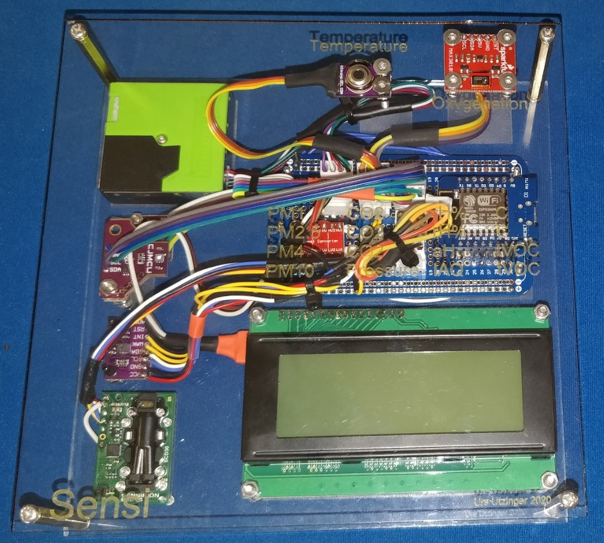
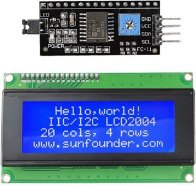
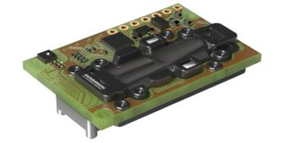
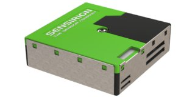
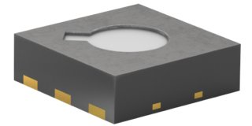
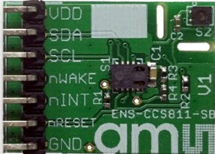
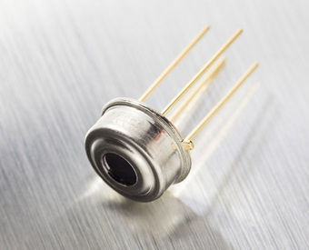
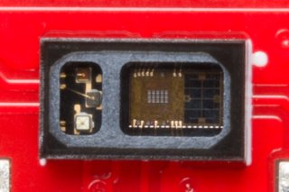

# Airquality Sensors with ESP8266
This project connects several air quality sensors via i2c bus to 
the ESP8266 microcontroller. It automatically detects the supported sensors. 
Most WiFi features of the ESP8266 are implemented (web, telnet, web sockets, mqtt, mDNS, ntp client, upload).

- [Airquality Sensors with ESP8266](#airquality-sensors-with-esp8266)
  * [Air Quality Sensor](#air-quality-sensor)
  * [Hardware Build Instructions](#hardware-build-instructions)
  * [Software Build Instructions](#software-build-instructions)
  * [Features](#features)
  * [Air Quality Assessments](#air-quality-assessments)
  * [Sensor System](#sensor-system)
    + [LCD](#lcd)
    + [SCD30](#scd30)
    + [SPS30](#sps30)
    + [SGP30](#sgp30)
    + [BME680](#bme680)
    + [CCS811](#ccs811)
    + [MLX90614](#mlx90614)
    + [MAX30105](#max30105)
  * [References](#references)
    + [All you need to know about ESP8266 programming](#all-you-need-to-know-about-esp8266-programming)
    + [ESP8266 memory optimization](#esp8266-memory-optimization)
    + [Software](#software)

<small><i><a href='http://ecotrust-canada.github.io/markdown-toc/'>Table of contents generated with markdown-toc</a></i></small>

## Air Quality Sensor 
There are many sensors for indoor air quality: [**Air Quality Sensors List**](Air_Quality_Sensors_List.md)

At this time this software **supports the following devices**:
- LCD 20x4  (requires 5V signal and power)
- SCD30 Senserion CO2  
- BME680 Bosch Temp, Humidity, Pressure, tVOC  
- BM[E/P]280 Bosch Temp, [Humidity], Pressure  
- SGP30 Senserione VOC, eCO2  
- CCS811 Airquality eCO2 tVOC  
- SPS30 Senserion particle sensor (requires 5V power, compatible with 3.3V logic signals)
- MLX90614 Melex temp contactless
- MAX30105 Maxim pulseox (in progress)
- more will be added in future

The electrical and softare specifications of the selected sensors are listed in [**Sensor Specs**](Sensor_Specs.md).

It should be straight forward to use this frame work to expand but also to remove unwanted modules.

Many gas sensors are not suitable for low power operation as a metal oxid sensor needs to be heated for a brief time. 
For humidity, tempterauter and pressure mesaurements, the system can run from a battery.

## Hardware Build Instructions
To build the system one will need to consider the [**ESP8266 pinout and configuratin**](ESP8266_i2c.md) as well as the [**Wiring of the Board**](Wiring_of_Board.md)
As can be seen in the images below, I use a standard PCB and add JST connectors and socker for ESP.
The front and back panel I cut on laser cutter. I use M2.5 stand offs. 

Sorry no circuit diagram with pullup and wire connections has been made to include in the docs at this time.

## Software Build Instructions
The software folder in this destribution will need to become the main sketch folder (Arduino Preferences). When opening Sensi main program, all other modules are loaded.

This software will work with ESP8266 2.x and 3.x Arduino Libary. However several libraries were modified for 3.x compatibility as listed below. The ```byte``` statement was replaced with ```uint8_t```.   

All hard coded settings are stored in .h files in the ```src``` folder.

For first time progamming of a new ESP, you will need to upload via a USB cable. Afterwards you can use OTA or http uploader.

You will also need to upload files to the LittleFS using the https://github.com/earlephilhower/arduino-esp8266littlefs-plugin in order to view the sensor from a web browser. After initial upload you can upload files to (http://host/upload).

The libraries included in this distribution are:

- SPS30 Senserion particle, Paul Van Haastrecht library, modified to accept faulty version information, replaced byte with uint8_t, https://github.com/uutzinger/sps30.git
- SCD30 Senserion CO2, Sparkfun library, using interrupt from data ready pin, replaced byte with uint8_t, https://github.com/uutzinger/SparkFun_SCD30_Arduino_Library.git
- SGP30 Senserion VOC, eCO2, Sparkfun library, replaced byte with uint8_t, https://github.com/uutzinger/SparkFun_SGP30_Arduino_Library.git
- BME680 Bosch Temp, Humidity, Pressure, VOC, Adafruit library https://github.com/adafruit/Adafruit_BME680.git
- BM[E/P]280 Bosch Temp, [Humidity,] Pressure Sparkfun library, replaced byte with uint8_t,   https://github.com/uutzinger/SparkFun_BME280_Arduino_Library.git
- CCS811 Airquality eCO2 tVOC, Sparkfun library, using interrupt from data ready pin https://github.com/sparkfun/SparkFun_CCS811_Arduino_Library.git
- MLX90614 Melex temp contactless, Sparkfun library, replaced byte with uint8_t, https://github.com/uutzinger/SparkFun_MLX90614_Arduino_Library.git
- MAX30105 Maxim pulseox, not implemented yet, Sparkfun library, replaced byte with uint8_t,  https://github.com/uutzinger/SparkFun_MAX3010x_Sensor_Library.git
- LCD 20x4, LiquidCrystal_PCF8574* or Adafruit_LCD library* both modified for wireport selection https://github.com/uutzinger/Adafruit_LiquidCrystal.git  https://github.com/uutzinger/LiquidCrystal_PCF8574.git
- MQTT publication to broker, PubSubClient library http://pubsubclient.knolleary.net
- ESP_Telnet, https://github.com/LennartHennigs/ESPTelnet
- ESPNTPClient, https://github.com/gmag11/ESPNtpClient
- ArduWebSockets, https://github.com/Links2004/arduinoWebSockets
- ArduJSON, https://github.com/bblanchon/ArduinoJson.git

## Features

Data is displayed on an **LCD** and can be sent to **MQTT server** or viewed through **Web Page**. A **Websocket** interface has been created that transmitts data in JSON format. It is unwise to enable MQTT and Web Page services simultanously as likley there is not enough memory and CPU time available to handle both.

When wireless connection is lost, the wifi driver scans for available networks and reestablishes the connection. Up to 3 netids can be setup.

The software currenlty works with **multiple separate i2c buses**. The software **scans** all availabel pins for i2c devices and **identifies the pin configuration for SCL and SDA** for the supported sensors. The motivation to provide multiple ports was that some breakout boards affect the proper operation of other boards. For example LCD display corrupts within 12-24hrs time frame. SPS30 does not properly reset after program upload. MLX sensor sometimes reports excessive or negative temperature. ESP8266 Arduino frame work does not provide independent i2c interfaces and all share one single i2c layer. Its not possible to run multiple i2c ports at different clock speeds and with different clock stretching simultanously. However before each communication one can switch to a differnt SCL and SDA pins and set the clock speed.

Most **settings** are stored in EEPROM and can be changed at runtime. Over the air programming **OTA**, **JSON** encoding, **HTTP firmware updater** (http://host:8890/firmware), **telnet** interface, **HTTP** server are provided and can be enabled/disabled.

Runtime settings are listed in [**Runtime Settings**](Runtime_Settings.md) and over the terminal with '?'  command.

Passwords are set but since SSL is not available, the system is not particulary secure. For more secure use, disable telnet and littleFS upload.

Debugging of code was enabled with two approaches:
1) Setting debugging levels (e.g. 0 = no debuggin). Setting debug level to 99 will printout sensor values and system status continously. Refer to the help menu for the debug levels. 
2) Enable ```#define DBG``` creates DBG output at all essential function calls, so that a software crash could be pin pointed. This will create a lot of output and is not
   suited for regular operation of the system. Its better to install the ESP Exception Decoder and to analyze the crash dump from the terminal.
3) sending "." will provide execution times of the major function calls. This was created to identify which sections of the code delay the main loop substantially.

If you do not want the backlight of the LCD to blink you can turn it off in the settings. You can also have it turn itself off during the night.

## Air Quality Assessments

The sensor readings are compared to expected range and **LCD backlight flashes** if readings are outside recommended range. Those ranges are:

* Pressure: A change of 5mbar within in 24hrs can cause headaches in suseptible subjects. The program computes the avaraging filter coefficient based on the sensor sample interval for a 24hr smoothing filter. 
* CO2:  a value >1000ppm is poor
* Temperature:  20-25.5C is normal range
* Humidity:  30-60% is normal range (Since this project was made in Arizona, 25-65% is a better range)
* Particles:  
P2.5: >25ug/m3 is poor  
P10: >50ug/m3 is poor   
* tVOC:  a value >660ppb is poor

It is common to find CO2 concentration above 1000ppm in single family homes. To lower CO2 concentration you need to open two windows at opposite sides of the house and let air circulate.

## Sensor System

  

### LCD
The LCD screen is a HD44780 compatible display with 4 lines of 20 characters.  
It uses and I2C to LCD adapter that is based on PCF8574T.  
  

### SCD30
The sensiorion SCD30 is a light based CO2 sensors and measures addtionally temperature and humidity.
https://www.sensirion.com/en/environmental-sensors/carbon-dioxide-sensors/carbon-dioxide-sensors-co2/  
  

### SPS30
The sensirion SPS30 is a particulate matter sensor based on light scattering.  
https://www.sensirion.com/en/environmental-sensors/particulate-matter-sensors-pm25/  
  

### SGP30
The senserion SGP30 is a metal oxide gas sensor measuting tVOC and eCO2.  
https://www.sensirion.com/en/environmental-sensors/gas-sensors/sgp30/  
  

### BME680
The Bosch BME680 measures temperature, humidity, perssure and airquality. Air quality is a VOC senosr.  
https://www.bosch-sensortec.com/products/environmental-sensors/gas-sensors-bme680/  


### CCS811
The sciosense device measures eCO2 and tVOC.  
https://www.sciosense.com/products/environmental-sensors/ccs811-gas-sensor-solution/  


### MLX90614
The Melex MLX sensor series is a contact less IR temperature sensor.  
https://www.melexis.com/en/product/MLX90614/Digital-Plug-Play-Infrared-Thermometer-TO-Can   


### MAX30105
The Maxim 30105 is a multi wavlength reflectance sensor, built to detect heartbeat and blood oxygenation.  
https://www.maximintegrated.com/en/products/interface/sensor-interface/MAX30105.html  
  

## References

### All you need to know about ESP8266 programming
- https://tttapa.github.io/ESP8266/Chap01%20-%20ESP8266.html
- https://arduino-esp8266.readthedocs.io/en/latest/index.html

### ESP8266 memory optimization
- https://arduino-esp8266.readthedocs.io/en/latest/PROGMEM.html
- https://esp8266life.wordpress.com/2019/01/13/memory-memory-always-memory/

### Software

- SPS30 Senserion particle,                     Paul Vah library,
- SCD30 Senserion CO2,                          Sparkfun library, using interrupt from data ready pin
- SGP30 Senserion VOC, eCO2,                    Sparkfun library
- BME680 Bosch Temp, Humidity, Pressure, VOC,   Adafruit library
- BM[E/P]280 Bosch Temp, [Humidity,] Pressure   Sparkfun library
- CCS811 Airquality eCO2 tVOC,                  Sparkfun library, using interrupt from data ready pin
- MLX90614 Melex temp contactless,              Sparkfun library
- MAX30105 Maxim pulseox, not implemented yet,  Sparkfun library

Data display through:
- LCD 20x4,                                     LiquidCrystal_PCF8574 or Adafruit_LCD library

Network related libraries:
- MQTT publication to broker                    PubSubClient library http://pubsubclient.knolleary.net
- ESP_Telnet                                    https://github.com/LennartHennigs/ESPTelnet
- ESPNTPClient                                  https://github.com/gmag11/ESPNtpClient
- ArduWebSockets:                               https://github.com/Links2004/arduinoWebSockets

Other Libraries:
ArduJSON                                         https://github.com/bblanchon/ArduinoJson.git

Wifi
- https://arduino-esp8266.readthedocs.io/en/latest/esp8266wifi/

Displaying Data through Web Site
- https://www.mischianti.org/2020/05/24/rest-server-on-esp8266-and-esp32-get-and-json-formatter-part-2/
- https://tttapa.github.io/ESP8266/Chap16%20-%20Data%20Logging.html
- https://gist.github.com/maditnerd/c08c50c8eb2bb841bfd993f4f2beee7b
- https://github.com/Links2004/arduinoWebSockets

Working with JSON:
- https://en.wikipedia.org/wiki/JSON
- https://circuits4you.com/2019/01/11/nodemcu-esp8266-arduino-json-parsing-example/

- Creating Webcontent on ESP
- GET & POST https://randomnerdtutorials.com/esp8266-nodemcu-http-get-post-arduino/
- JSON & autoupdate https://circuits4you.com/2019/03/22/esp8266-weather-station-arduino/
- JSON & tabulated data https://circuits4you.com/2019/01/25/esp8266-dht11-humidity-temperature-data-logging/
- Simple autorefresh https://circuits4you.com/2018/02/04/esp8266-ajax-update-part-of-web-page-without-refreshing/

WebSocket
- https://www.hackster.io/s-wilson/nodemcu-home-weather-station-with-websocket-7c77a3
- https://www.mischianti.org/2020/12/21/websocket-on-arduino-esp8266-and-esp32-temperature-and-humidity-realtime-update-3/
- http://www.martyncurrey.com/esp8266-and-the-arduino-ide-part-10a-iot-website-temperature-and-humidity-monitor/

HTTP Update Server for Firmware Update
- https://www.hackster.io/s-wilson/nodemcu-home-weather-station-with-websocket-7c77a3

NTP
- https://tttapa.github.io/ESP8266/Chap15%20-%20NTP.html

Air Quality
- Indoor: https://www.dhs.wisconsin.gov/chemical/carbondioxide.htm

Weather Data (not included yet)
- http://api.openweathermap.org/data/2.5/weather?q=Tucson,US&APPID=e05a9231d55d12a90f7e9d7903218b3c