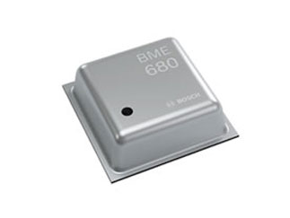

# Airquality Sensors with ESP8266
The goal of this project is to connect several air quality sensors via i2c bus to a wireless microcontroller.

There exisits many sensor for indoor air quality (see below). If individual gas concentration needs to be meausred, usualy a metal oxid sensor needs to be heated for a brief time. Power consmpution will be high and the system should be run using an AC adapter. For humidity, tempterauter and pressure, the system can run from a battery.

The hardware includes a 3.3V to 5V with voltage level shifter and an ESP8266.
At this time the software supports the following devices:
- LCD 20x4  (requires 5V signal and power)
- SCD30 Senserion CO2  
- BME680 Bosch Temp, Humidity, Pressure, VOC  
- BM[E/P]280 Bosch Temp, [Humidity], Pressure  
- SGP30 Senserione VOC, eCO2  
- CCS811 Airquality eCO2 tVOC  
- SPS30 Senserion particle, requires 5V power, compatible with 3.3V logic signals
- MLX90614 Melex temp contactless  
- MAX30105 Maxim pulseox (in progress)

The system displays the measured values on an LCD and also connects to an MQTT server and publish results. When connection is lost, it scans for available networks and reasblishes the connection,

The software currenlty supports 3 separate i2c buses. Some breakout boards affect the proper operation of others boards. For example LCD display corrupts within 12-24hrs time frame when it shares bus with many sensors. SPS30 does not properly reset after program upload when LCD driver is on the same bus. MLX sensor sometimes reports excessive or negative temperature when combined with other senors.

The software scans all availabel pins for i2c devices and records the pin configuration for the supported sensors.

Most settings are stored in EEPROM and can be changed at runtime.

## Air Quality Assessments
The sensor readings are compared to expected range and LCD backlight flashes if readings are otuside recommended range. Those ranges are:
* Pressure:  
A change of 5mbar within in 24hrs can cause headaches in suseptible subjects. The program computes the avaraging filter coefficient (a) based on the sensor sample interval for a 24hr smoothing filter y = (1-a)\*y + a*x
* CO2:  a value >1000ppm is poor
* Temperature:  20-25.5C is normal range
* Humidity:  30-60% is normal range
* Particles:  
P2.5: >25ug/m3 is poor  
P10: >50ug/m3 is poor   
* tVOC:  a value >660ppb is poor

## Sensor System
  

### LCD
The LCD screen is a HD44780 compatible display with 4 lines of 20 characters.  
It uses and I2C to LCD adapter that is based on PCF8574T.
  

### SCD30
The sensiorion SCD30 is a light based CO2 sensors and measures addtionally temperature and humidity.
https://www.sensirion.com/en/environmental-sensors/carbon-dioxide-sensors/carbon-dioxide-sensors-co2/  
  

### SPS30
The sensirion SPS30 is a particulate matter sensor based on light scattering.  
https://www.sensirion.com/en/environmental-sensors/particulate-matter-sensors-pm25/  
  

### SGP30
The senserion SGP30 is a metal oxide gas sensor measuting tVOC and eCO2.  
https://www.sensirion.com/en/environmental-sensors/gas-sensors/sgp30/  
  

### BME680
The Bosch BME680 measures temperature, humidity, perssure and airquality. Air quality is a VOC senosr.  
https://www.bosch-sensortec.com/products/environmental-sensors/gas-sensors-bme680/  

### CCS811
The sciosense device measures eCO2 and tVOC.  
https://www.sciosense.com/products/environmental-sensors/ccs811-gas-sensor-solution/  

### MLX90614
The Melex MLX sensor series is a contact less IR temperature sensor.  
https://www.melexis.com/en/product/MLX90614/Digital-Plug-Play-Infrared-Thermometer-TO-Can   

### MAX30105
The Maxim 30105 is a multi wavlength reflectance sensor, built to detect heartbeat and blood oxygenation.  
https://www.maximintegrated.com/en/products/interface/sensor-interface/MAX30105.html  
  

### ESP8266
  
D5..D7 are available for address selct, chip select and data ready signals. D0 affects boot behaviour if connected.

## Power Consumption
| Sensor | Measurement Interval | Power Consumption | Sleepmode/Idlemode | Data ready hardware | Cost |
| --- | --- | --- | --- | --- | --- |
|| min, max [default] [s]| [mW]| [mW]|| $
| LCD      | 0.3...
| SCD30    | 2..1800 [4]  | 19  | Reduce Interval      | Yes | 54 |
| SPS30    | 1...    | 60  | 0.36    | No  | 45 |
| SGP30    | 1...    | 48  | NA      | No  | 24 |
| BME680   | 1,3,300  | 0.9 | 0.00015 | No  | 10 |
| CCS811   | 0.25,1,10,60   | 4   | 0.019   | Yes | 12 |
| MLX90614 | 0.25/1    |     |         |     |  9 |
| MAX30105 | 0.01... |     |         |     | 12 |

## Air Quality Sensors to Consider
Below is a list of sensors to consider for airquality measurements. This projects incldes software to support the ones marked in bold.

### Temperature, Humidity Pressure
* **BME680**, Bosch, Temp, Humidity 8s, Pressure, 1s VOC +/-15% IAQ output, AliExpress $12  
* BME280, Bosch, Temp, Humidity, Pressure Aliexpresss $3  
* BMP280, Pressure and Temp, $1  
* MS8607

### Temperature
* TMP102, Texas Instruments, 0.5C, -25-85C 
* TMP117, Teaxs Instruments, 3C without calibration, -40-125C

### Humidity
* HTU21D
* AHT20
* SHTC3
* Si7021
* HIH6130

### Pressure
* MS5803-30BA, 14bar
* MS5803-14BA, 14bar
* MS5803-02BA, 2bar
* MS5803-01BA, 1bar
* MS5637-02BA, 2bar
* MS5637-30BA, 30bar
* BMP085
* BMP180

### Particle Sensor
* **SPS30**, Sensirion Digikey $50  
* ZH03, Winzen, PM2.5, PM1 and PM10, 5V serial with fan  
* ZH03A, ALiexpress $14.5  
* ZH03B, AliExpress $13  
* ZPH01, Winzen, PM2.5, VOC  
* PMS503 GS, Plantower aliexpress $13  
* GP2Y1010AU0F,Sharp,  AliExpress $3.23  
* PM2.5 with GP2Y... with display AliExpress $17.5  
* SDS011, HAILANGNIAO, AliExpress $19  
* HONEYWELL HPMA115S0-TIR l, $19  

### Volotile Organic Compounds (VOC)
* CCS811, TVOCs, eCO2, NTC option, burn in and run in, AliExpress $10  
* **SGP30**, SENSIRION, TVOCs, eCO2, minimal run in, AliExpress $11  

### Figaro
* TGS8100, Figaro, airpollutant  
* CDM7160, Figaro, CO2, 360-5000ppm +/-50ppm, 5V 10mA avg, I2C   
* TGS5042, Figaro, CO, 0-10000ppm +/- 10ppm, output is current needs transimpedance amplifier  
* FECS40-1000, Figaro CO, 0-1000 1ppm +/-2%  

### More than one Compund
* MQ6 Hanwei, Propane, Butane, 200-10000ppm, 5V, Analog in  
* MQ4 Hanwei, Methane, 200-10000ppm, 5V, Analog in  
* MQ135, Winzen, Amonia, Benzene, Sufide, Hanwei, https://www.winsen-sensor.com/sensors/voc-sensor/mq135.html   
* MQ138, Winzen, VOC, 5V analog in  
* ME3-NH3, Winzen, Amonia  
* MICS5524 sgxsensortech, CO 1-1000, Ethanol 10-500, Hydrogen 1-1000, Ammonia 1-500, Methane>1000, 32mA  
* MQ3 Hanwei, similar to MICS5524, 140mA  
 
### CO (Carbon Monoxide)
* MQ7 Hanwei, CO, 20-1000ppm, 5V, Ananlog in, cycling of suppply voltage needed  
* ME2-CO, Winzen, CO, 0-1000, external circuit needed  
* ME3-CO, WInzen, CO, 0-1000ppm 0.5ppm, electronic circuit needed  
* ME4-CO, Winzen, CO, 0-1000,  external circuit needed  
* MQ7B, Winzen, CO 10-500ppm, 5V analog, 60s heater time  
* ME9B, Winzen, CO and Methane, 10-500ppm, 300-10000ppm, analog  
* ZE03, Winzen, CO and many others  
* AP-0005, Alphasense, 0-5000ppm electronic circuit needed, gaslabs $69 with mxboard $199  
* EC4-500-CO, SGX Sensortech  

### Oxygen
* Alphasense, O2-A3, electrochemical, current output, gaslabs.com $60  

### CO2
* ExplorIR®-W CO2 Sensor, GSS 0-100 CO2, serial out, gaslabab.com $120  
* Telaire T6613, Amphenol, 0-2000ppm CO2, i2c, Aliexpress $120  
* MG812, Winzen, CO2 300-10000ppm, electrolyte, 5V analog in  
* MD62, Winzen, CO2, 0-100%, thermal, full bridge  
* MH-Z14, Winze, CO2, 0-5% optical, 5V serial 3.3  
* MH-Z14A, Winzen, CO2 0-5% +/- 50ppm 5V serial  
* MH-Z19B, Winzen, CO2 0-2000ppm +/-50ppm, 5V serial, solderless pcb compatible  
* MH-410D, Winzen, CO2 0-5% +/- 50ppm, 5V serial  
* MHZ16, Winzen, CO2 0-5% +/-50ppm, 5V serial long tube  
* **SCD30**, Sensirion, CO2, I2C  
* **SCD40**, smaller than SCD30, not yet released
